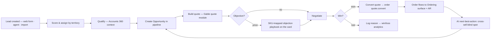
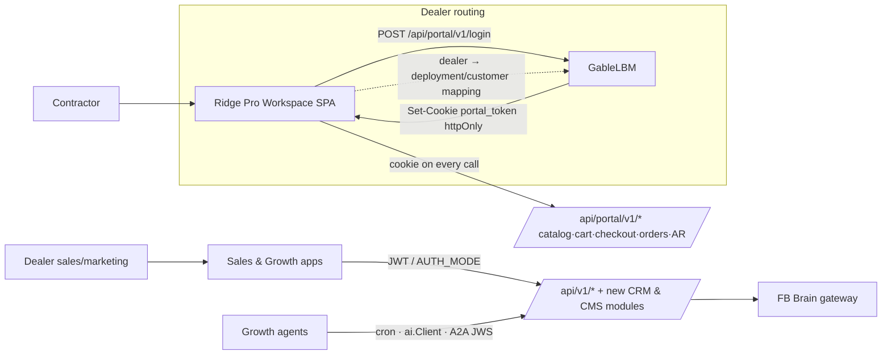

# Ridge — Design System & User Flows

> Companion to the Ridge PRD set. Covers the unified visual language (Industrial Dark + a first-class Light theme), information architecture per surface, and the key end-to-end user flows.
> **Interactive preview:** `assets/ridge-design-preview.html` (published artifact — hi-fi screens for all three surfaces with a working light/dark toggle).
> **Flow / IA / architecture board:** Miro (link added on creation).

---

## 1. Design language

Ridge adopts GableLBM's **Industrial Dark** system as-is — it's already the de-facto system in both repos (`/home/user/lumbernow/frontend/src/styles/theme.css` header: *"Based on GableLBM Industrial Dark Design Kit"*). The only additions are a **light theme** and a **shared token source**.

### 1.1 Core tokens (unchanged)

| Token | Hex | Role |
|---|---|---|
| Gable Green | `#00FFA3` | Primary actions, success, active glow |
| Deep Space | `#0A0B10` | Global background (dark) |
| Slate Steel | `#161821` | Cards, sidebar, modals (dark) |
| Safety Red | `#F43F5E` | Errors, stockouts, credit hold, past-due |
| Blueprint Blue | `#38BDF8` | Technical data, links |
| Amber | `#F59E0B` | Warning / upsell / needs-review |
| Body font | **Inter** (400/500/600) | UI text |
| Data font | **JetBrains Mono** | Every number, SKU, price, dimension, UOM |

**Aesthetic:** high contrast, data density, zero clutter; glassmorphism panels; green glow on primary/active; skeletons, never spinners, for layout loads.

### 1.2 Light theme (new — required)

Today the system is dark-only: `theme.css` has no light palette and `ThemeService` sets a `data-palette` attribute with no matching CSS (a dead seam). Ridge makes **light/dark a first-class, user-toggled choice** and ships both everywhere.

| Token | Dark | Light | Notes |
|---|---|---|---|
| `--bg` | `#0A0B10` | `#EEF1F5` | slate-biased white, not pure |
| `--surface` | `#161821` | `#FFFFFF` | cards/panels |
| `--surface-2` | `#1E2029` | `#F4F7FA` | insets, table stripes |
| `--border` | `rgba(255,255,255,.09)` | `#D8E0E8` | |
| `--text` | `#EAF0F6` | `#0C1420` | |
| `--text-2` | `#A7B4C4` | `#45566B` | secondary |
| `--primary` (ink) | `#00FFA3` | `#00A870` | green readable as text on light (AA); fills keep `#00C98A`+ |
| Semantic (red/blue/amber) | as above | darkened ~1 step | AA contrast on light ground |
| Glow | `0 0 14px rgba(0,255,163,.28)` | *none* | glow reads as noise on light |

**Implementation:**
- **Token-level theming.** Define the palette as CSS custom properties; components read `var(--*)` only, never a raw hex. Redefine tokens under `@media (prefers-color-scheme: dark/light)` **and** under `[data-theme="dark"]` / `[data-theme="light"]` so an explicit user toggle wins over the OS in both directions.
- **Customer SPA (Lit):** extend `ThemeService` (`frontend/src/services/theme.service.ts`) to persist a `light|dark` choice per user and stamp `data-theme` on `:root`; wire the retired `data-palette` seam to real token sets.
- **ERP/Sales/Growth frontend (Tailwind):** GableLBM's `tailwind.config.js` already uses `darkMode: ["class"]` — add the light token values and a persisted toggle in the app shell.
- **Accent discipline:** Gable Green is the accent on both grounds; semantic colors (good/warning/critical) are separate from the accent. Validate WCAG AA in both themes.

### 1.3 Shared token source (recommended)
`#00FFA3` is currently hard-coded independently in `theme.css` (`--ln-*`) and `tailwind.config.js`. Introduce **one token file** (JSON or a Tailwind `@theme`) that generates both, so the palette lives in exactly one place. Non-blocking but prevents drift as the surfaces multiply.

### 1.4 Rendering-model split (must resolve for shared components)
- Customer SPA = **Shadow DOM** Lit (`ln-` prefix, styles in `css`` `).
- ERP/Sales/Growth = **Light DOM** Lit + Tailwind (`gable-` prefix, `createRenderRoot(){return this;}`).
Tailwind classes don't cross the Shadow boundary, so component code can't be shared verbatim. **Guidance:** share *tokens*, not *components*, across the boundary; if a component genuinely must appear in both (e.g. a price cell, a status pill), author it token-driven and duplicate the thin markup rather than forcing one DOM model.

---

## 2. Information architecture

### 2.1 Surface 1 — Ordering & Procurement (customer, white-labeled)
Hash-routed Lit SPA (the "Pro Workspace"), authenticated via Gable's `portal_token`.
```
Storefront (public, SSR — see Surface 3)
└─ Pro Workspace (authenticated)
   ├─ Catalog ─ Product detail (coverage calculator, customer price, add-to-board)
   ├─ Projects (Procurement Board / kanban)
   │  └─ Project workspace ─ Takeoff · Quote builder · Client presentation
   ├─ Agent Mode (full-screen AI orchestrator)
   ├─ Orders ─ Order detail ─ Delivery tracking (POD/ETA)
   ├─ Invoices & AR (balance, past-due, pay)
   ├─ Reorder
   └─ Team & approvals · Field Mode toggle · Light/Dark
```

### 2.2 Surface 2 — Sales & Marketing CRM (internal, `gable-*` `/sales/*`)
Replaces the `/sales → /quotes` redirect with a real tree.
```
/sales
├─ Dashboard (role-aware: inside rep · outside rep · manager)
├─ Pipeline (opportunities by stage, weighted forecast)
├─ Leads (inbox, scoring, convert)
├─ Accounts (360 — extends existing account detail: ledger/invoices/contacts/activity)
├─ Tasks & follow-ups
├─ Forecast & quotas
├─ Territories & assignment (admin)
└─ Campaigns & sequences (marketing)
+ Mobile field app (outside reps) — check-ins, activity, mobile pipeline
```

### 2.3 Surface 3 — CMS + Growth (internal authoring + public SSR site)
```
Public SSR site (Astro)                Growth Studio (admin, /growth/*)
├─ Home                                 ├─ Pages (block editor, draft/publish/versioning)
├─ Category / Brand                     ├─ Articles / guides / FAQ
├─ Product landing                      ├─ Media (PIM-linked)
├─ Location / store (local SEO)         ├─ Agents (SEO/GEO · lead-gen · citation monitor)
├─ Guides / blog / FAQ                  ├─ Approval queue (human-in-the-loop)
└─ (JSON-LD · sitemap · robots)         └─ Analytics (organic · citations · leads)
```

---

## 3. Key user flows

### 3.1 Contractor: browse → takeoff → order (Surface 1)

```mermaid
flowchart LR
  A[Discover via SSR content / search] --> B[Log in — portal_token cookie]
  B --> C[Browse catalog · customer price + availability]
  C --> D{Build the job}
  D -->|manual| E[Add to Project Board from PDP]
  D -->|AI| F[Describe job / drop plan or photo]
  F --> G[Takeoff Assistant returns phased BoM]
  G --> H[Approve & Stage → board]
  E --> I[Project Workspace · phases, qty, markup]
  H --> I
  I --> J[Quote / white-label presentation]
  J --> K[Submit to dealer → POST /checkout → order.CreateOrder]
  K --> L{Credit gate}
  L -->|ok| M[Order CONFIRMED · GL + AR posted]
  L -->|over limit| N[ON_HOLD → dealer review]
  M --> O[Track delivery · POD / ETA]
  O --> P[Reorder / cross-sell next job]
```


### 3.2 Sales rep: lead → won → order (Surface 2)


### 3.3 Growth: content → citation → lead → pipeline (Surface 3)

```mermaid
flowchart LR
  A[SEO/GEO agent drafts / optimizes content] --> B[Human approval queue]
  B -->|approve| C[Publish → Astro SSR page]
  C --> D[JSON-LD · sitemap · AI-crawler robots]
  D --> E[Indexed + cited by Google / AI answer engines]
  E --> F[Visitor lands · direct-answer + calculator]
  F --> G[Form fill / inquiry]
  G --> H[Lead-gen agent enriches + scores]
  H --> I[web_leads → CRM leads]
  I --> J[Surface 2 pipeline]
  J --> K[Order in Gable ERP]
  K --> L[Order-velocity signal → next content + cross-sell]
  L --> A
```


### 3.4 Auth & integration (cross-cutting)


---

## 4. Screen inventory (rendered in the preview + Miro)

| Surface | Key screens |
|---|---|
| Ordering | Catalog · Product detail + coverage calculator · **Project Workspace + Takeoff Assistant** · Procurement Board · Agent Mode · Order tracking · AR dashboard |
| Sales CRM | **Rep dashboard** (KPIs · accounts slipping · next-best-action) · **Pipeline board** · Lead inbox · Account 360 · Tasks · Forecast · Mobile field |
| Growth | **Agent console** (runs · citation monitor · approval queue) · **CMS block editor** · Public SSR content page (schema badges) · Analytics |

Bolded screens are built in `assets/ridge-design-preview.html`.

---

## 5. Design open items
- **Claude Design Projects** — pull the team's canonical components/illustration once links are shared (import into Miro via `import-claude-design-from-url`); reconcile against the tokens above.
- **Field Mode** — the high-contrast outdoor variant (spec'd in `product_docs/01_customer_portal.md`) sits alongside light/dark as a third, task-specific mode for the jobsite; define whether it's a separate palette or a high-contrast modifier on dark.
- **Iconography** — standardize on Lucide (already used in GableLBM via `lib/icons.ts`).
- **Motion** — reserve the green glow + 200ms/100ms panel transitions for primary/active state; respect `prefers-reduced-motion`.
