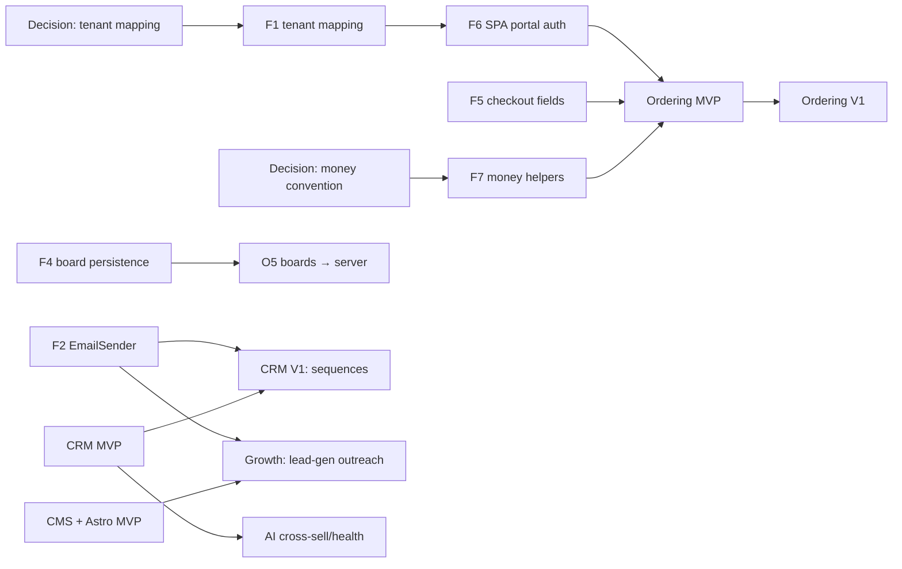

# Ridge — Execution Roadmap & Backlog

> Turns the PRD set into a sequenced build plan. Read alongside `00_RIDGE_MASTER_PRD.md` (phasing) and the surface PRDs (feature detail).
> **This is a planning artifact, not a commitment** — sizes are rough and meant for sequencing, not deadlines.

## How to read this

- **Repo tag:** `[LN]` = LumberNow → Ridge frontend (customer app / Pro Workspace); `[GBL]` = GableLBM ERP (Go backend + `gable-*` frontend); `[SSR]` = new Astro content site; `[INFRA]` = deploy/edge/DNS.
- **Size (rough):** `S` ≈ 1–3 dev-days · `M` ≈ 1–2 weeks · `L` ≈ 2–4 weeks · `XL` ≈ 1–2 months. One engineer, order-of-magnitude only.
- **Gate:** ⛔ = blocked by an open decision (see `§ Decision gates`); ▶ = blocked by another epic/story.
- Every story cites the real module/file it touches so it can be sized properly before starting.

---

## 1. Epic map

```
FOUNDATIONS (Phase 0) ── unblocks everything
  F1 Dealer→ERP tenant mapping        [GBL/INFRA] ⛔ D1
  F2 Real EmailSender (SMTP/SendGrid) [GBL]
  F3 Light-mode tokens + toggle       [LN/GBL]
  F4 Project Board persistence        [GBL]
  F5 Checkout honors delivery/payment [GBL]
  F6 Ridge SPA on portal auth         [LN]      ▶ F1
  F7 Money boundary helpers           [LN/GBL]  ⛔ D2

PHASE 1 — wire the money surface
  O  Ordering MVP  [LN]  ▶ F5,F6,F7,(F4)
  C  Sales CRM MVP [GBL]

PHASE 2 — depth & discovery
  OV Ordering V1   ·  CV CRM V1 (▶F2)  ·  GM CMS + Astro MVP [SSR]

PHASE 3 — autonomy & intelligence
  AG SEO/GEO + lead-gen agents (▶F2,GM)  ·  AI cross-sell/health/coaching  ·  MF mobile field · payments
```

## 2. Critical path


**Longest chain to first customer order online (post-decision):** `F7 (cents migration, L)` is now the long pole — it gates O1/O2/O4 alongside `F1 → F6`. Mitigation: F7's build-ready plan (`06`) sequences the **portal subset first** so Ordering can start against already-migrated portal endpoints without waiting for the full ERP-wide migration.

---

## 3. Phase 0 — Foundations

### F1 · Dealer → ERP tenant mapping `[GBL/INFRA]` `L` ⛔ D1
The direct-to-portal model needs to route a given dealer to the right GableLBM deployment/customer. GableLBM is single-tenant-per-deployment; Ridge is the multi-dealer face.
- F1.1 Resolve the mapping strategy (edge router vs per-dealer subdomain vs thin gateway) — output of Decision D1. `S`
- F1.2 Implement dealer resolution (host/subdomain → portal base URL + branding via `GET /api/portal/v1/config`). `M` `[INFRA/LN]`
- F1.3 Session/cookie scoping so `portal_token` is correct per dealer host. `M` `[GBL]`

### F2 · Real EmailSender `[GBL]` `M`
Only `LogEmailService` exists (`internal/notification/email.go`). Blocks CRM sequences, lead-gen outreach, and the dormant reporting scheduler.
- F2.1 `SMTPEmailSender`/`SendGridEmailSender` implementing the `EmailService` interface + `SendEmailWithAttachment`. `M`
- F2.2 SPF/DKIM/DMARC + per-tenant sender identity + opt-out/suppression list (CAN-SPAM). `M`
- F2.3 Wire into config (`internal/config/config.go`) with runtime keys via `system_settings`/`ai.KeyStore` pattern. `S`

### F3 · Light-mode tokens + toggle `[LN/GBL]` `M`
System is dark-only today; `ThemeService` sets a `data-palette` with no matching CSS.
- F3.1 Define the light token set (see `04_DESIGN_AND_FLOWS.md §1.2`); validate WCAG AA both themes. `S`
- F3.2 `[LN]` Extend `theme.service.ts` to persist `light|dark` and stamp `data-theme`; wire the dead `data-palette` seam. `S`
- F3.3 `[GBL]` Add light values to `tailwind.config.js` (`darkMode:["class"]` already present) + app-shell toggle. `S`
- F3.4 Shared token source (one JSON/`@theme` generating both `--ln-*` and Tailwind colors). `M` (optional, prevents drift)

### F4 · Project Board persistence `[GBL]` `L`
Ridge boards (phases, labor, markup, takeoff provenance) live only in browser `localStorage` (`project.service.ts`). GableLBM's `internal/project` is thin (`Project{ID,CustomerID,Name,Status}`).
- F4.1 Schema: `ridge_boards`, `board_phases`, `board_line_items`, `board_labor`, takeoff provenance. UUID PKs, money-as-cents. `M`
- F4.2 Portal endpoints (extend `internal/project` under `/api/portal/v1/projects/*`) for board CRUD + line items + phases. `M`
- F4.3 One-time `localStorage → server` import path for existing demo boards. `S` `[LN]`

### F5 · Checkout honors delivery/payment `[GBL]` `M`
`portal/cart.go:Checkout` passes line items but only *logs* `DeliveryMethod`/`DeliveryAddress`/`PaymentMethod`/`Notes`.
- F5.1 Thread delivery method (DELIVERY/PICKUP) + address into `order.CreateOrder`. `M`
- F5.2 Payment method (ACCOUNT now; CARD deferred to Phase 3) honored + validated against credit gate (`order.Service.overCreditLimit` → `ON_HOLD`). `S`

### F6 · Ridge SPA on portal auth `[LN]` `M` ▶F1
- F6.1 Login/session via `POST /api/portal/v1/login` (`portal_token` httpOnly cookie); wire `client.ts` `onUnauthorized`. `S`
- F6.2 Retire LumberNow-backend calls (`/v1/auth`, `/v1/projects`, `/v1/ai/chat`); repoint services at portal endpoints. `M`
- F6.3 Delete/park the LumberNow Go backend from the deploy path. `S`

### F7 · Money → int64 cents migration `[GBL/LN]` `L` — **DECIDED: migrate first (D2)**
Per D2, we unify on int64 cents *before* Phase 1 rather than carrying two conventions into a payments product. Portal (`portal/model.go`), quotes, reporting, POS, daily-till migrate from float64 dollars to int64 cents to match `order`/`invoice`/`account`. This is now a **gating Wave-1 epic** for Ordering's money surfaces (O1, O2, O4). Full build-ready plan: `06_MONEY_CENTS_MIGRATION.md`.
- F7.1 Call-site inventory + DB column audit (money `DECIMAL(10,2)` vs physical-qty `DECIMAL(19,4)` which is NOT money). `S`
- F7.2 Migrate portal DTOs + `cart.go`/`checkout` conversions to cents; align `quote`, `reporting`, `pos`, `dashboard`. `L`
- F7.3 Frontend: portal/quote pages adopt `formatCents()`; remove direct `.toFixed(2)` on money. `M`
- F7.4 Regression tests around tax/rounding and the `customers.balance_due` cents/dollars collision. `M`

---

## 4. Phase 1 — Wire the money surface

### Epic O · Ordering MVP `[LN]` ▶F5,F6,F7
- O1 Catalog + customer pricing from `GET /api/portal/v1/catalog` (`CustomerPrice`, `PriceSource`, `Available`). Replace mock/`CatalogService`. `M`
- O2 Cart + checkout→order via `/cart` + `POST /checkout`. Replace the `alert()` "Send RFQ" stub in `ln-project-sidebar.ts`. `M` ▶F5
- O3 Orders list + detail + `POST /orders/reorder`; replace localStorage order status. `M`
- O4 Invoices + AR dashboard from `GET /dashboard` + `/invoices` (BalanceDue, PastDue, CreditLimit). `M`
- O5 Project Boards → server (persist via F4; migrate `ProjectService`). `M` ▶F4
- O6 Field Mode + light/dark in the workspace (uses F3). `S`

### Epic C · Sales CRM MVP `[GBL]`
New Go modules + the `/sales/*` route tree (replaces the `/sales → /quotes` redirect). Reuses `customer`, `quote`, `crm activity`, `salesteam`.
- C1 `lead` module: schema (`leads`), intake API, scoring stub, convert-to-customer. `RegisterRoutes` `/api/v1/leads`. `M`
- C2 `opportunity` + `pipeline`: `opportunities`, `pipeline_stages`; weighted value; quote↔opportunity link (`quote.convert` rolls up). `L`
- C3 `task` module: extend `crm_activities` with tasks/reminders/due/assignment; auto-capture ERP events (quote sent, order placed) as activities. `M`
- C4 `/sales/*` frontend: Rep dashboard (KPIs, accounts-slipping from order-velocity + AR), Pipeline board, Lead inbox, Accounts 360 (extend existing `AccountDetailPage`). `gable-*` Light DOM. `L`
- C5 Role dashboards: inside rep vs manager views; reuse `dashboard` module + new pipeline aggregates. `M`

---

## 5. Phase 2 — Depth & discovery (epic-level)

### Epic OV · Ordering V1 `[LN/GBL]`
AI takeoff live end-to-end (server-side `ai.Client` `Generate` + `ExtractMaterialList` vision OCR, Approve-&-Stage gate) `L` · Deliveries/POD/ETA from `/deliveries` `M` · Team purchasing + approvals (`/users`,`/invites`) `M` · Cross-sell "don't-forget" attach engine `M`.

### Epic CV · CRM V1 `[GBL]` ▶F2
Forecasting + quotas (`quotas`) `M` · Territories + assignment rules (`territories`) `M` · Manager dashboards `M` · Marketing campaigns + email sequences (`campaigns`,`campaign_steps`,`campaign_sends`; needs F2) `L` · reuse `pim.GenerateCollateral` for content `S`.

### Epic GM · CMS + Astro MVP `[SSR/GBL]`
CMS content model + `/api/v1/cms/*` (supersedes `about_blocks` JSONB) `L` · Astro SSR site rendering home/category/product/**location** with JSON-LD (Product/Offer/LocalBusiness/FAQ/Breadcrumb), sitemap.xml, robots.txt (allow GPTBot/PerplexityBot/Google-Extended), OG/canonical `L` · public content read endpoint for the site `M` · Industrial-Dark parity `S`.

---

## 6. Phase 3 — Autonomy & intelligence (epic-level)

- **AG · Growth agents** ▶F2,GM: SEO/GEO content agent (reuse `pim.GenerateSEO`/`GenerateCollateral`, `ai.Client`, `robfig/cron`; `seo_runs` + `citation_checks` observability, mirrors `reorder_runs`) with human-in-the-loop approval `L` · inbound lead-gen (`web_leads` → CRM `leads`) `M` · outbound prospecting sequences `L` · citation/rank monitor `M`.
- **AI · Sales intelligence**: cross-sell/next-best-action (buying-pattern gap vs similar-tier accounts) `L` · account-health/churn scoring (order velocity + AR aging) `M` · rep-coaching Nudge (SKU-mapped objection playbooks — the old LumberNow Nudge-Sidebar vision) `M`.
- **MF · Mobile & payments**: outside-rep field app (reuse `/driver` layout + `044_offline_sync.sql`) `L` · card payments in checkout (`/payments/card`) `M`.

---

## 7. Suggested sequencing (waves)

| Wave | Focus | Contents |
|---|---|---|
| **0 — decisions** | ✅ done | D1 = per-dealer subdomain · D2 = migrate cents first |
| **1 — foundations** | parallel | **F7 (cents migration) is the long pole** — do its portal subset first; F2, F3, F4, F5 in parallel; F1(subdomain)→F6 on the critical path |
| **2 — first dollar online** | Ordering MVP | O1→O4 (money surfaces need F7's portal subset; +O5 once F4 lands); demoable customer order into Gable |
| **3 — first pipeline** | CRM MVP | C1→C4; reps working leads/pipeline on real Gable data |
| **4 — discovery** | Growth MVP | GM (CMS + Astro) so agents have a surface to publish to |
| **5 — depth** | V1s | OV + CV in parallel (CV needs F2 from Wave 1) |
| **6 — autonomy** | agents + AI | AG + AI + MF |

Waves 2 and 3 can run concurrently (different repos/teams: `[LN]` vs `[GBL]`).

---

## 8. Decision gates (resolve before/at Wave 0)

- **D1 — Multi-dealer → single-tenant ERP mapping. ✅ RESOLVED: per-dealer subdomain → dedicated Gable deployment.** Host resolved at the edge/SPA runtime config → portal base URL; branding from `GET /api/portal/v1/config`; cookie scoped per-origin. Zero ERP re-architecture. Revisit a gateway (option ②) only if one-contractor-many-dealers becomes a real requirement. F1 is now mostly `[INFRA]`/config.
- **D2 — Money convention. ✅ RESOLVED: migrate to int64 cents first.** The float→cents migration moves *before* Phase 1 and becomes gating epic **F7** (`L`). Rationale: don't carry two money conventions into a payments product. See `06_MONEY_CENTS_MIGRATION.md` for the build-ready plan. Trade-off accepted: Phase-1 "first dollar online" starts after F7 lands (or after the portal subset of F7 lands — see the spec's incremental sequencing).
- **D3 — CMS build vs buy.** DB-backed content service vs Sanity/Strapi/Payload (detailed in `03_CMS_GROWTH_AGENTS_PRD.md`). Gates GM; not needed until Wave 4.
- **D4 — Marketing email vs native only.** Native sequences on F2 vs a marketing tool for nurture. Affects CV scope; not gating.

## 9. Top risks

- **Tenant mapping** is the single riskiest unknown — it colors auth, deploy, and the "direct to portal" model. Decide D1 first.
- **EmailSender (F2)** blocks two epics (CV, AG); it's independent, so start it in Wave 1 regardless.
- **localStorage → server (O5/F4)** is a data-shape reconciliation (rich Ridge board vs thin ERP project); size F4.1 carefully before committing O5.
- **Money drift** — every price surface is a chance to mix float/cents; centralize in F7 and code-review price rendering.
- **Autonomous publishing** (AG) must stay human-in-the-loop through Phase 3 for brand + CAN-SPAM safety.
